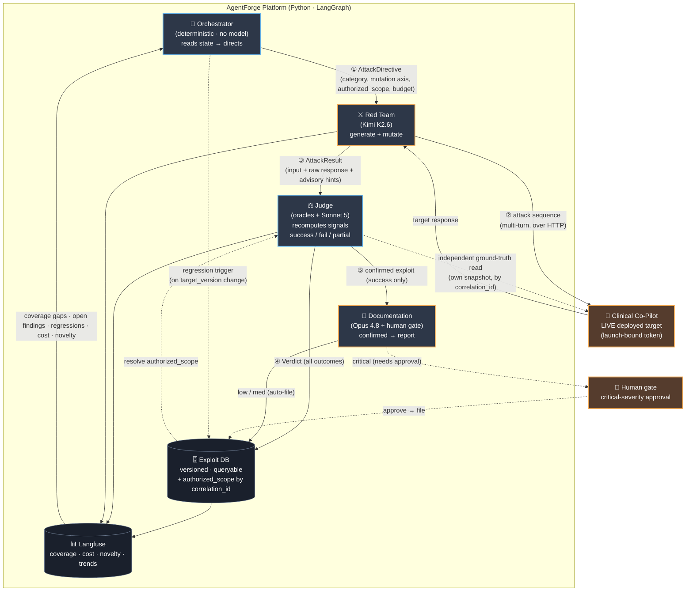

# ARCHITECTURE — AgentForge Adversarial Evaluation Platform

*Week 3 · multi-agent plan + agent-interaction diagram. Companion docs: `THREAT_MODEL.md`,
`AGENT_INTERACTION.md` (evidence packet), `MODEL_ASSIGNMENT.md`, `DECISION_RECORD.md`
(build-vs-configure), `OBSERVABILITY.md`, `contracts/README.md`.*

---

## Summary

AgentForge is a multi-agent platform that continuously **discovers, evaluates, escalates, and
documents** vulnerabilities in the deployed Clinical Co-Pilot (`oe-module-copilot`), treated as a
live, mostly-black-box HTTP target. A static payload suite or a single-agent pipeline does not
satisfy the goal: the value is that *agents discover* findings against a moving target and
*generalize* as attacks mutate. Specific seed findings (V1 local-file-read, V2 cross-patient, V5
extracted-value feedback loop) exist only as ground truth to prove discovery works and to seed
regression — they are runtime inputs, never wired-in constants.

Four agents at deliberately different trust levels divide the work. The **Orchestrator** is
deterministic code (no model): it reads coverage gaps, open findings, regressions, novelty, and
budget from the observability substrate, decides what the Red Team targets next, triggers regression
runs on a target-version change, and halts when cost accrues without signal. The **Red Team** (Kimi
K2.6, Moonshot) generates novel attacks, mutates partial successes toward this target's
grounding-bypass, and runs multi-turn sequences — but never evaluates its own work. The **Judge** is
deterministic-first: reused clinical oracles (PHI regex, citation-grounding, cross-patient, cost)
decide most verdicts, with a `claude-sonnet-5` semantic layer only for the residue; it recomputes
every signal independently and owns ground truth by `correlation_id`. The **Documentation** agent
(`claude-opus-4-8`) turns confirmed exploits into professional vuln reports with no human writing,
gated by a human on critical severity.

The single most important boundary is **Red Team ⟂ Judge**, enforced by shape, not policy: different
processes, different providers (Moonshot vs Anthropic), no shared context, and the Judge treats the
Red Team's `observed_hints` as advisory only. An agent that both attacks and grades is compromised
by design; the attacker is given no channel to influence a verdict.

Four architectural decisions frame the build. **Language (D1): Python, separate repo** — the
agent/red-team ecosystem (PyRIT, Garak), Langfuse, and the Anthropic + OpenAI-compatible clients are
Python-first; the reused Week 1/2 PHP oracles are called via shell-out or ported. **Framework (D2):
LangGraph** — a checkpointable typed state graph whose edges are the versioned `/contracts` schemas;
checkpointing doubles as the regression harness's replay/resume substrate. **Models (D3):**
deterministic Orchestrator · Kimi Red Team · oracles+Sonnet 5 Judge · Opus 4.8 Documentation —
determinism at the eval boundary comes from structured output + input-keyed replay + effort, not
temperature (rejected on both Anthropic models). **Observability (D6): self-hosted Langfuse** —
per-agent traces and cost keyed by `correlation_id`.

The platform is graded against a hospital-CISO bar: every autonomous step must be explainable, the
human keeps the irreversible calls (critical-severity publish, remediation, ship/no-ship), and the
platform attacks only over the guarded HTTP surface — no core edits, no service accounts, no
`$ignoreAuth`. Delivery is staged: an Architecture-Defense evidence packet, an MVP with one live
agent role against the deployed target, and a Final four-agent mutation loop with a versioned
regression harness.

---

## Agent-interaction diagram

Orange border = AI-powered · blue = deterministic · solid = data flow · dashed = human / trigger /
independent read. The **Orchestrator never touches the target**; the **Judge never shares context
with the Red Team** and independently reads its own ground truth. Numbered edges ①③⑤ map 1:1 to the
schemas in `/contracts/v1/`.

---

## The four agents

| Agent | Trust level (model) | Reads | Writes | Never does |
|---|---|---|---|---|
| **Orchestrator** | Coordination — deterministic (no model) | coverage, findings, regressions, budget | directives, regression triggers, halt signals | execute attacks itself |
| **Red Team** | Offensive — **Kimi K2.6** (Moonshot) | directives, seed corpus, target responses | attacks → target, results → Judge | evaluate its own attacks |
| **Judge** | Adjudication — oracles + **`claude-sonnet-5`** | results **+ its own** ground truth (by `correlation_id`) | verdicts → exploit DB + Documentation | share context with Red Team; trust hints as verdicts |
| **Documentation** | Reporting — **`claude-opus-4-8`** + human gate | confirmed (`success`) verdicts | vuln reports (low/med auto; critical human-gated) | file critical without approval; file `partial`/`fail` |

Full per-layer model rationale + best-quality config: `MODEL_ASSIGNMENT.md`. Full trust-boundary and
failure-mode narrative: `AGENT_INTERACTION.md`.

---

## Architectural decisions

| # | Decision | Choice | Why (short) |
|---|---|---|---|
| **D1** | Language / repo | **Python, separate repo** | Agent/red-team ecosystem + Langfuse + Anthropic/OpenAI-compat clients are Python-first; "independent repo" is a hard requirement. PHP oracles reused via shell-out/port. |
| **D2** | Multi-agent framework | **LangGraph** | Checkpointable typed state graph; edges = `/contracts`; checkpointing = the regression replay/resume substrate; a standard a CISO recognizes. |
| **D3** | Model per layer | deterministic Orchestrator · Kimi K2.6 · oracles+Sonnet 5 · Opus 4.8 | Deterministic where auditability matters; open-weights offensive model where frontier models refuse; premium writer only on low-volume reporting. |
| **D6** | Observability | **Langfuse (self-hosted)** | Native per-generation model+cost; self-hosted holds the demo-PHI processor line. |
| **D7** | Build-vs-configure | hybrid | Configure Garak/PyRIT seeds + ZAP web-fuzzing + Semgrep SAST; build the four agents. Full record: `DECISION_RECORD.md`. |

### LangGraph state graph (D2)

Nodes are the agents; **edges are the `/contracts/v1` messages** (`AttackDirective` ①,
`AttackResult` ③, `Verdict` ⑤). The graph state carries `correlation_id`, `target_version`, the
authorized scope, and the campaign budget. A **checkpointer persists state after each node**, which
gives three things for free: resume after a crash, deterministic replay of a stored campaign, and
the regression harness's re-issue path. The deterministic **Orchestrator is a conditional router** —
it reads the observability substrate and routes to the next Red Team directive or halts; it contains
no model call, so every routing decision is auditable code. The Judge runs in a **separate process**
from the Red Team (not merely a separate node) to make the trust boundary structural.

---

## Failure modes (the five typed error schemas)

| Failure | Who raises it | Platform behavior |
|---|---|---|
| `target_unreachable` | Red Team | bounded backoff → if persistent, halt campaign, alert |
| `budget_exceeded` | Orchestrator | halt immediately (cost accruing without signal) |
| `judge_timeout` | Judge | mark result `unadjudicated`, requeue once, then escalate to human |
| `no_findings` | Orchestrator | close category as covered-for-now, redirect to next gap |
| `regression_detected` | Judge / harness | flag, trigger full regression run, block "resilience improving" claim |

Each is a typed, closed schema in `contracts/v1/errors.schema.json`; every error is traceable to the
raising agent by `correlation_id`.

---

## AI vs deterministic tooling — where each is used, and why

The PRD leaves this split deliberately open and observes that *"traditional non-AI security tooling
may … outperform LLM-driven approaches … especially around deterministic validation, replay testing,
fuzzing"* and that part of the work is *"determining when AI-driven approaches are useful [and] when
deterministic systems are more reliable."* AgentForge treats **"agent" as a role + trust boundary,
not "an LLM,"** and puts a model on a layer **only where the work is irreducibly generative or
semantic**. Everything else is deterministic on purpose.

| Layer | AI or deterministic | Why it sits on this side of the line |
|---|---|---|
| **Orchestrator** | Deterministic (no model) | Same state → same directive = reproducible campaigns; every routing decision is auditable code (the CISO bar); $0 on the busiest control loop; cannot drift. A fuzzy tie-break escape hatch (`claude-haiku-4-5`, `effort: low`, single-choice output) is **deferred, not adopted** — v1 stays 100% auditable. |
| **Judge — oracles (Tier 1)** | Deterministic | Reused Week 1/2 detectors (PHI regex, citation-grounding, cross-patient vs `authorized_scope`, cost) settle **most** verdicts at zero token cost; auditable; cannot drift; they enforce the *never-approve-a-confirmed-exploit* invariant as **code, not a prompt**. |
| **Judge — semantic (Tier 2)** | AI — `claude-sonnet-5` | Invoked **only** for verdicts an oracle cannot settle (did the response *semantically* comply with an injected instruction in a way no regex catches?). Reproducibility comes from structured output + input-keyed replay, **not** temperature (rejected 400 on Sonnet 5). |
| **Red Team** | AI — Kimi K2.6 (Moonshot) | Generating and mutating novel attacks is irreducibly generative. An open-weights model is workable under an authorized-pentest system prompt where frontier RLHF models refuse offensive work; it is the cheapest capable tier on the highest-volume layer; and a **different provider** from the Judge hardens the boundary. |
| **Documentation** | AI — `claude-opus-4-8` | Reproduce-and-fix-ready long-form prose is the entire deliverable, so the top write tier goes here. Runs at the **lowest** volume (confirmed successes only), so the premium tier is affordable; human-gated on critical. |

**Deterministic ≠ fewer agents.** The PRD defines agents by *"different roles, capabilities, and
trust levels,"* not by implementation, and explicitly requires the architecture to justify *"where AI
is used versus deterministic tooling."* Putting the **control** loop (Orchestrator) and the
**adjudication floor** (Judge oracles) on deterministic code *is* that justification, not a shortcut:
these are exactly the surfaces where a hospital CISO needs reproducibility and auditability, and where
an LLM would add drift, cost, and unexplainable decisions. The platform's *adaptivity* still lives
where the PRD wants it — in the Red Team's generate-and-mutate loop and in the Orchestrator's
data-driven prioritization (coverage gaps · open findings · regressions · novelty · budget), which is
the line between *"running attacks randomly"* and a platform that *"is learning."* And a **stochastic
Red Team stays compatible with a deterministic regression gate**: the exploit DB stores the realized
attack bytes and regression **re-issues** them (asserting the predicate fired), it never
re-generates — so determinism at the eval boundary survives a non-deterministic attacker.

---

## AI-use disclosure

| Agent | AI? (model) | Verification that follows |
|---|---|---|
| Orchestrator | No — deterministic state reads | n/a (auditable logic) |
| Red Team | Yes — **Kimi K2.6** | outputs are *inputs to the Judge*, never verdicts; `observed_hints` advisory; provider-independent from the Judge |
| Judge | **Deterministic-first**; semantic = **`claude-sonnet-5`** | oracles are auditable + recomputed independently; the Sonnet-5 layer is bound by a labeled ground-truth set and the invariant *Judge never approves a confirmed exploit*; reproduces via structured-output + input-keyed replay (no temperature pinning — 400 on Sonnet 5) |
| Documentation | Yes — **`claude-opus-4-8`** | data-quality validation before write; **human gate on critical**; files `success` only |

**Residual risk + drifting-judge detection.** The MVP Judge is a deterministic oracle, so it cannot
*drift* (same input → same verdict). But deterministic ≠ correct: an oracle can be consistently
wrong (a PHI regex with false negatives). So oracles **and** the semantic layer are measured against
a **labeled judge-eval ground-truth set** — accuracy, not just consistency. The semantic layer is
additionally bound by the never-approve-a-confirmed-exploit invariant. Residual risks the human owns:
critical-severity publishing, remediation approval, and ship/no-ship.

---

## Cost & the platform's own rate-limit / backoff

**Cost tiers (AI Cost Analysis, per `MODEL_ASSIGNMENT.md`):** deterministic Orchestrator + Judge
oracles are $0; Kimi Red Team is the cheapest LLM tier but the highest volume (attack-gen dominates);
Sonnet 5 Judge scales with attacks, minimized by deterministic-first; Opus 4.8 Documentation is
premium but lowest-volume (confirmed successes only) and prompt-cached. The Orchestrator's
budget-halt is the runtime cost guardrail.

**Per external API the platform calls — pagination / rate-limit / backoff:**
- **LLM providers** (Moonshot for Kimi; Anthropic for Sonnet 5 + Opus 4.8): exponential backoff +
  jitter on `429`; on sustained limit, abort the attempt with a typed `budget_exceeded` /
  `target_unreachable`-adjacent error surfaced to the Orchestrator so the campaign halts cleanly
  rather than hammering a limited dependency.
- **Co-Pilot target** (OAuth2 + guarded routes): bounded, depth-monitored work queue for regression
  runs; a `429` or transient `5xx` triggers bounded backoff, then `target_unreachable`.
- **Observability backend** (Langfuse): non-blocking, buffered emit; a trace-sink failure degrades
  observability but never blocks an attack — recorded, not fatal.

---

## Contracts & data flow

All inter-agent communication uses versioned JSON Schema (draft 2020-12) in `contracts/v1/`, with
contract tests on both producer and consumer. One canonical six-value `attack_category` taxonomy is
defined once and `$ref`'d everywhere; the OWASP dual-Top-10 mapping is a separate field. The
`RedTeam→Judge` schema is the designated **external interop seam** for integration week (stranger-
implementable: explicit enums, versioned, worked examples). See `contracts/README.md`.
