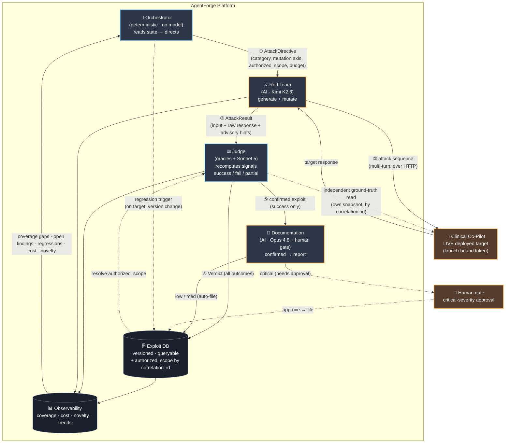

# Agent Interaction — Evidence Packet Skeleton

*AgentForge · Week 3 · drop into ARCHITECTURE.md §Agent Interaction*

> Review-corrected (fixes #1/#2): the Judge **recomputes** all verdict signals with its own
> oracles and reads its **own** ground truth — it never trusts the Red Team's advisory hints or
> any authorization context the Red Team supplies.

---

## The four agents (one line each)

| Agent | Trust level (model) | Reads | Writes | Never does |
|---|---|---|---|---|
| **Orchestrator** | Coordination — deterministic (no model) | coverage state, open findings, regressions, budget | attack directives, regression triggers, halt signals | execute attacks itself |
| **Red Team** | Offensive — AI (**Kimi K2.6** / Moonshot) | attack directives, seed corpus, target responses | attack sequences → target, results → Judge | evaluate its own attacks |
| **Judge** | Adjudication — deterministic oracles + **`claude-sonnet-5`** semantic layer | attack results **+ its own** ground-truth snapshot / authorized scope (by `correlation_id`) | verdicts → exploit DB + Documentation | share context with Red Team; **trust the Red Team's hints as verdicts** |
| **Documentation** | Reporting — AI (**`claude-opus-4-8`**) + human gate | confirmed (`success`) verdicts | vuln reports (low/med auto; critical human-gated) | file critical without human approval; file a `partial`/`fail` |

> Per-layer model rationale and the config that makes each best-quality (incl. why the Judge cannot
> pin temperature and reproduces via structured-output + input-keyed replay) are in
> [`MODEL_ASSIGNMENT.md`](./MODEL_ASSIGNMENT.md). Observability backend = **Langfuse** (self-hosted).

---

## Interaction diagram

**Legend:** orange border = AI-powered · blue border = deterministic · solid = data flow ·
dashed = human / trigger / independent read. The **Orchestrator never touches the target**; the
**Judge never shares context with the Red Team** (separate process) and **independently reads its
own ground truth** (dashed edge to target + `authorized_scope` resolved from the DB by
`correlation_id`). The numbered edges ①③⑤ map 1:1 to the schemas in `/contracts/v1/`.

---

## Trust boundaries (name these in the defense)

1. **Red Team ⟂ Judge — enforced by shape, not just policy.** Different processes, different
   providers, no shared context. Critically, the Judge **recomputes every verdict signal** from the
   raw `input_sequence` + `target_response`; the Red Team's `observed_hints` are contractually
   **advisory only**. And the Judge resolves the **authorized scope + ground-truth snapshot itself**
   (by `correlation_id`), never from the Red Team. This is the single most important boundary — an
   agent that both generates and evaluates is compromised by design, so the attacker is given no way
   to influence the verdict, not even by self-reporting signals.
2. **Documentation → human gate on critical** — low/medium auto-file; **critical-severity requires
   human approval before publish**. Mirrors the target's own "human owns irreversible calls" bright
   line, applied to the platform. Documentation files only `success` verdicts.
3. **Remediation is advisory-only** — the platform proposes patches, never pushes them. A finding
   that implicates an auth danger-zone is a *report*, not a fix.
4. **Target-URL allowlist** — the platform can only be pointed at the sanctioned target
   (`authorized_scope.target_base_url`), so it can't be turned against systems it shouldn't attack.
5. **Platform ⟂ target core** — the platform attacks over the guarded HTTP surface only; no core
   edits, no service accounts, no `$ignoreAuth` paths.

---

## Failure modes (= the five error schemas)

| Failure | Who raises it | Platform behavior |
|---|---|---|
| **target_unreachable** | Red Team | retry w/ bounded backoff → if persistent, halt campaign, alert |
| **budget_exceeded** | Orchestrator | halt campaign immediately (cost accruing without signal) |
| **judge_timeout** | Judge | mark result `unadjudicated`, requeue once, then escalate to human |
| **no_findings** | Orchestrator | close category as covered-for-now, redirect Red Team to next gap |
| **regression_detected** | Judge / harness | flag, trigger full regression run, block "resilience improving" claim |

Each has a typed, closed schema in `/contracts/v1/errors.schema.json`. Every error is traceable to
the agent that raised it via `correlation_id`.

---

## AI-use disclosure (skeleton for ARCHITECTURE.md)

| Agent | AI? (model) | Verification that follows |
|---|---|---|
| Orchestrator | No — deterministic state reads | n/a (auditable logic) |
| Red Team | Yes — **Kimi K2.6** (Moonshot; open-weights, offensive-tractable, provider-independent from the Judge) | outputs are *inputs to the Judge*, never trusted as verdicts; `observed_hints` are advisory |
| Judge | **Deterministic-first**; semantic layer = **`claude-sonnet-5`** | oracles (PHI regex, grounding check vs its own snapshot, cross-patient vs `authorized_scope`, cost) are auditable and recomputed independently; the Sonnet-5 semantic layer is governed by labeled ground-truth + the invariant *Judge never approves a confirmed exploit*, and reproduces via structured-output + input-keyed replay (no temperature pinning — 400 on Sonnet 5) |
| Documentation | Yes — **`claude-opus-4-8`** (top write-quality tier) | data-quality validation before write; **human gate on critical**; files `success` only |

**Drifting-judge detection.** The MVP Judge is a deterministic oracle, so it cannot *drift*
(same input → same verdict, always). But deterministic ≠ correct: an oracle can be consistently
wrong (a PHI regex with false negatives). So the oracles are **also** validated against a labeled
judge-eval ground-truth set (measuring oracle *accuracy*, not just consistency). When the semantic
layer is added, it is measured against that same set and bound by the never-approve-a-confirmed-
exploit invariant.
